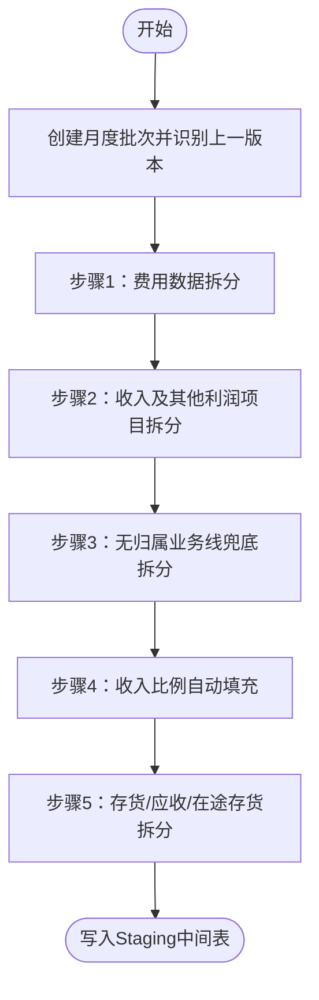
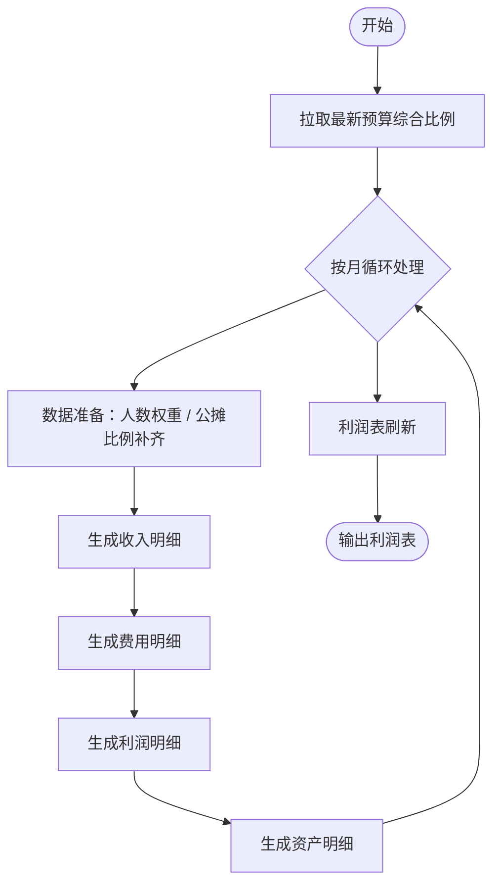
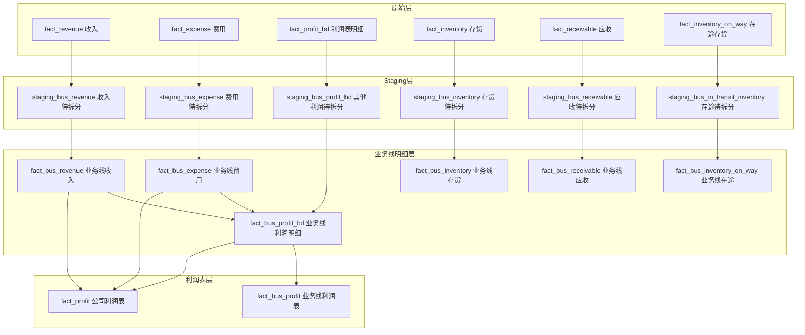

# 业务线核算流程手册

> 适用对象：财务、业务线运营、数据产品及技术同事阅读参考。
> 核心目标：把公司账务数据按业务线维度拆分，形成可填报、可核算、可出损益报表的完整链路。
> 整理时间：2026-06-12

---

## 一、整体流程概览

业务线核算整体遵循三段式：**抽数 → 拆分 → 出表**。


| 主流程 | 作用 | 关键产出 |
|---|---|---|
| **业务线Staging抽取** | 把收入、费用、利润其他项、存货、应收、在途存货等原始数据，按组织+业务线维度打平，生成可填报的中间表 | `staging_bus_*` 系列表 |
| **业务线损益计算** | 基于人工拆分比例、组织架构、预算工资比例、公摊综合比例，把数据拆到各业务线，并计算损益指标 | `fact_bus_revenue`、`fact_bus_expense`、`fact_bus_profit_bd`、资产明细表、`fact_profit`、`fact_bus_profit` |

---

## 二、业务线Staging抽取流程

### 2.0 运行参数与模块选择

Prefect 中继续使用现有部署 `主流程-业务线Staging抽取`。参数 `modules` 是支持多选的固定列表，不需要手工输入模块名称，可选项为：`费用`、`收入`、`其他损益`、`存货`、`应收`、`在途存货`。部署默认选中全部六项；不传或传空列表也按全部模块运行。

只选择部分模块时，流程仍创建一个完整的新批次：先复制上一批的全部 Staging 基础行、业务线比例和审核状态，再删除并重建所选模块。未选择模块保持上一批内容不变；所选模块中来源编号和唯一层级未变化的记录继续按既有规则继承比例及审核状态。若当前月份还没有历史批次，必须先运行一次全部模块，不能直接做部分刷新。

部分刷新成功后的批次状态规则与全量抽取一致：若该月已经有 `FILLING` 批次，新批次保持 `READY`，由管理员比较确认后再启用，不会在填报过程中静默切换。

### 2.1 流程图



### 2.2 各步骤说明

#### 步骤1：费用数据拆分

把费用按不同组织属性分别处理：

| 组织类型 | 处理逻辑 |
|---|---|
| **行政中心/人力资源中心** | 特定费用科目（含房租类科目）先从行政/HR 中心按**发薪人数比例**拆分到目标组织；随后与后台人力费用一起，按**预算工资比例表（fact_bus_wage_rate）**确定业务线拆分比例 |
| **中台部门** | 作为自身数据进入 staging，等待手工填报 |
| **后台部门** | 非人力、非分摊费用按后台分组进入 staging；人力费用及已分摊费用（含房租）必须关联**预算工资比例表** |
| **前台部门** | 直接进入 staging，等待按业务线拆分 |
| **已明确分摊业务线的费用** | 若原始单据已指定业务线，则该业务线比例直接设为 100% |

费用 Staging 同时保留两个来源字段：`数据来源` 固定为“费用”，用于标识数据类型；`来源层级`保存分摊前的原始组织层级，避免行政/人力费用分摊后丢失来源组织。

#### 步骤2：收入及其他利润项目拆分

- **收入**：从收入事实表取数，进入 `staging_bus_revenue`。
- **其他利润项目**：取利润表中的非主营项目，例如信用减值损失、公允价值变动收益、投资收益、营业外收支等，进入 `staging_bus_profit_bd`。
- 仅针对前台特定部门生成拆分底稿。

#### 步骤3：无归属业务线兜底拆分

针对组织架构上 `业务线=无` 的数据：

- 收入进入 `staging_bus_revenue`；
- 费用进入 `staging_bus_expense`；
- 其他利润项目进入 `staging_bus_profit_bd`。

注意：`无归属` 层级的数据不进入 staging，避免把无法解释的数据混入填报流程。

#### 步骤4：收入比例自动填充

- 计算当月 **国际业务中心** 与 **国内市场中心** 的收入合计；
- 按比例自动填充到 **智造管理中心** 和 **国际渠道运营中心** 对应的 `国际业务`、`国内硬件` 两列；
- 若两中心收入合计为 0，则跳过该月。

#### 步骤5：存货、应收、在途存货拆分

| 数据类型 | 拆分对象 | 关键过滤条件 |
|---|---|---|
| 存货 | 业务线为无、小POS、审核业务的存货 | — |
| 应收账款 | 业务线为无、小POS、审核业务的应收 | 排除内部关联方、余额为 0 |
| 在途存货 | 业务线为无、小POS的在途订单 | 未入库数量不为 0 |

在途存货金额计算：

```text
在途订单金额 = 未入库数量 × 单价 × COALESCE(汇率, 1)
```

汇率为空时按 1 计算；订单金额仅在展示时按“订单数量 × 单价”动态计算，不再单独落库。

### 2.3 Staging公共规则

- **动态建表/补列**：中间表不存在则自动创建，业务线新增时自动补列。
- **业务线字段来源**：统一读取 `dim_bus_line.bus_line`，只排除“无”和“抵销数”。历史终止业务线仍保留在底层比例列和批次继承中，前端是否可填报再根据 `status` 控制。
- **比例精度**：业务线比例保留 2 位小数；金额保留 3 位小数。
- **比例归一化**：每行已填业务线比例之和必须等于 1；若因四舍五入有差异，差额补到最大比例列。
- **默认状态**：所有记录初始状态为 `PENDING`，待人工审核确认。

### 2.4 Staging批次与重新下发

- 每次Staging抽取生成独立的 `batch_id`，不再删除或覆盖同期间的历史批次。
- 每个批次只对应一个会计月份，并生成便于识别的 `batch_no`：历史基线为 `BLS-YYYYMM-000`，后续重发依次为 `001`、`002`。
- 新批次按“来源编号 + 唯一层级”匹配上一填报批次；匹配成功时直接继承全部业务线比例和审核状态，新记录保持空比例和 `PENDING`。
- 新批次生成后自动与其 `previous_batch_id` 对比，按表统计旧记录、新记录、新增、删除、来源数据变化和未变化数量。业务线比例、审核状态、批次标识、行主键和创建时间不计入“来源数据变化”。Prefect 日志输出汇总，Flow Run 返回结果包含各表统计及少量变化样例；来源发生变化的样例会列出变化字段名，但不在日志中输出逐行数据。
- 普通填报人员只选择会计期间，不手工选择批次。前端应读取 `vw_staging_bus_*_current_edit` 视图，或查询该月份状态为 `FILLING` 的批次。
- 新批次生成成功后状态为 `READY`；如果该期间不存在当前填报批次，则自动进入 `FILLING`，否则由管理员确认后启用，避免填报过程中静默切换。
- 填报请求必须携带页面对应的 `batch_id`，更新时同时校验该批次仍是当前填报批次，避免旧页面写入失效批次。
- `fact_bus_line` 不保存批次历史。它仍是填报审核完成后上报形成的最终定稿比例表；只有上报成功后，管理员才将对应Staging批次标记为 `PUBLISHED`。
- 管理员可使用 `python scripts/manage_bus_line_staging_batches.py list|compare|activate|publish` 查询、对比、启用和发布批次。`publish` 必须在 `fact_bus_line` 上报成功后执行。

重新查看某个批次与上一批次的对比：

```bash
venv/bin/python scripts/manage_bus_line_staging_batches.py compare <batch_id> \
  --sample-limit 10
```

前端默认批次查询：

```sql
SELECT batch_id, batch_no
FROM bus_line_staging_batch
WHERE acct_period = DATE '2026-06-01'
  AND status = 'FILLING';
```

普通列表可以直接读取对应的 `vw_staging_bus_*_current_edit` 视图。保存时仍需提交页面返回的 `batch_id`，并在更新条件中校验它仍是当前批次：

```sql
UPDATE staging_bus_revenue AS staging
SET "国际业务" = :intl_rate,
    "国内硬件" = :domestic_rate
FROM bus_line_staging_batch AS batch
WHERE staging.id = :row_id
  AND staging.batch_id = :batch_id
  AND batch.batch_id = staging.batch_id
  AND batch.acct_period = staging."会计期间"
  AND batch.status = 'FILLING';
```

---

## 三、业务线损益计算流程

### 3.1 流程图



### 3.2 数据准备

在正式拆分前，需要准备三类基础数据：

| 基础数据 | 作用 |
|---|---|
| **组织架构** | 判断组织默认归属的业务线（前台/中台/后台） |
| **业务线拆分比例** | 人工填报或系统预置的 source_no 级拆分比例 |
| **人数权重** | 用于行政/HR 中心费用及房租费用的分摊：发薪人数分摊非房租费用，深圳人数分摊房租费用 |
| **预算工资比例** | 后台人力费用及已分摊费用按此比例拆分 |
| **公摊综合比例** | 把 `业务线=无` 的公摊收入/费用还原到各业务线 |

### 3.3 收入明细生成

1. 加载收入原始数据；
2. **手工拆分**：对已在拆分比例表中的收入，按设定比例拆分到各业务线；
3. **自动归属**：未在拆分表中的收入，按组织架构默认业务线 100% 归属；
4. 把收入字段转换为利润表科目（收入→营业收入，成本类→营业成本）；
5. 2025-08-01 起，`能源硬件` 统一重命名为 `能源运营`；
6. 对 `业务线=无` 的收入，按**公摊综合比例**还原；
7. 校验每条记录的业务线比例合计是否为 1；
8. 写入 `fact_bus_revenue`。

### 3.4 费用明细生成

1. 加载费用原始数据；
2. **手工拆分**：按比例表拆分；
3. **自动归属**：未在比例表中的费用，按组织架构默认归属；
4. **公摊补齐**：若手工拆分比例合计不足 100%，剩余部分作为 `业务线=无` 的公摊费用；
5. 同样执行能源硬件重命名；
6. 对 `业务线=无` 的费用按公摊综合比例还原；
7. 校验比例合计；
8. 写入 `fact_bus_expense`。

### 3.5 利润明细生成

1. 加载其他利润项目（营业外收支、投资收益、减值损失等）；
2. 手工拆分 + 自动归属；
3. 把收入明细、费用明细转换为利润表格式；
4. 加载抵销数：抵销数原始为累计数，通过 `本期 - 上期` 转成当月数，1 月直接取累计值；
5. 合并收入、费用、其他利润、抵销数；
6. 把 `无归属-其他调整-待摊事项` 替换为 `新国都本部-公共部门-公共部门`；
7. 校验比例合计；
8. 写入 `fact_bus_profit_bd`；
9. **公摊利润二次分摊**：对 `业务线=无` 的利润，按综合比例或特殊比例分摊到各业务线，并生成一正一负两笔调整分录（分摊 + 冲销）。

### 3.6 资产明细生成

| 资产类型 | 处理逻辑 |
|---|---|
| 应收账款 | 手工拆分 + 自动归属，所有金额类字段按 rate 拆分 |
| 存货 | 手工拆分 + 自动归属，数量/金额类字段按 rate 拆分 |
| 在途存货 | 手工拆分 + 自动归属，订单数量和未入库数量按 rate 拆分；单价、汇率保持单位属性，金额动态计算 |

校验规则：同一来源编号下，业务线比例合计必须等于 1。

### 3.7 利润表刷新

在所有月份数据计算完成后，统一刷新利润表：

#### 公司利润表 `fact_profit`

1. 汇总收入、费用、其他利润、抵销数；
2. 按 `财报合并 + 财报单体 + 唯一层级 + 会计期间` 透视；
3. 计算：
   - **毛利润** = 营业收入 - 营业成本
   - **营业利润** = 营业收入 - 税金及附加 - 营业成本 - 销售费用 - 管理费用 - 研发费用 - 财务费用 + 信用减值损失 + 资产减值损失 + 资产处置收益 + 公允价值变动收益 + 其他收益 + 投资收益
   - **净利润** = 营业利润 + 营业外收入 - 营业外支出 - 所得税费用

#### 业务线利润表 `fact_bus_profit`

与公司利润表逻辑相同，但多一个 **业务线** 维度，输出每个业务线的毛利润、营业利润、净利润。

---

## 四、核心核算规则

| 规则 | 说明 |
|---|---|
| **直接归属** | 组织架构上已绑定业务线的组织，其收入/费用/利润/资产默认 100% 归属该业务线 |
| **手工拆分** | 对跨业务线的单据，在业务线拆分比例表中按 source_no + 业务线 + 比例进行拆分 |
| **后台人力分摊** | 以预算工资比例表为基准 |
| **后台行政/HR非人力分摊** | 先按发薪人数比例分配到目标组织，再按预算工资比例确定业务线 |
| **后台分摊费用（含房租）** | 行政/HR 中心的房租等分摊费用属于已分摊费用，先按发薪人数分配到目标组织，最终业务线比例按预算工资比例表确定 |
| **公摊还原** | `业务线=无` 的收入/费用，按预算综合比例还原到各业务线 |
| **能源硬件切换** | 2025-08-01 后，`能源硬件` 统一视为 `能源运营` |
| **抵销数月度化** | 抵销数为累计数，通过相邻两期差值计算当月数，1 月直接取累计值 |
| **比例归一化** | Staging 写入时，单行已填业务线比例之和必须等于 1 |
| **无归属过滤** | Staging 阶段排除 `无归属` 层级数据 |
| **零值过滤** | 金额或比例为 0 / NULL 的记录不写入 |

---

## 五、关键运行注意事项

1. **必须先更新预算工资比例表**
   Staging 抽取前，必须保证目标月份 `fact_bus_wage_rate` 已有数据，否则后台人力及分摊费用步骤会报错终止。
   若两个历史组织改名后合并为同一个“唯一层级”，同期间、同业务线、同比例的重复记录会在读取时自动合并；若比例不同则中断并提示，不允许直接求和或平均。

2. **预算综合比例失败会沿用旧比例**
   损益计算流程会尝试拉取最新预算综合比例；若失败仅告警不中断，沿用旧比例可能导致当月结果偏差。

3. **多月份分批执行**
   支持单个月或多个月循环执行，避免一次性加载大量数据导致内存溢出。

4. **Staging 按批次重复执行**
   每次运行生成新的 `batch_id`，不会删除目标月份的旧批次。相同“来源编号 + 唯一层级”的记录继承上一填报批次的比例和审核状态；并发运行会通过期间锁避免同时创建冲突批次。
   分步写库任务不做任务级自动重试，因为各步骤会分段提交。任一步骤失败后由主流程清理整个失败批次，重新运行时创建新的批次，避免重试重复写入掩盖首次错误。

5. **比例校验会阻断流程**
   收入、费用、利润、资产拆分后都会校验比例合计是否为 1，不通过会直接报错。

6. **能源硬件过渡期**
   2025-08 前后数据口径变化，跨月对比时需注意重分类影响。

7. **组织分组硬编码维护**
   后台/中台/前台分组在配置中维护，新增中心后需同步更新，否则会被归入“其他”。

8. **利润其他项日期列不同**
   `staging_bus_profit_bd` 使用 `日期` 列，其余 staging 表使用 `会计期间` 列，清理和写入时需区分。

---

## 六、数据表分层流转


