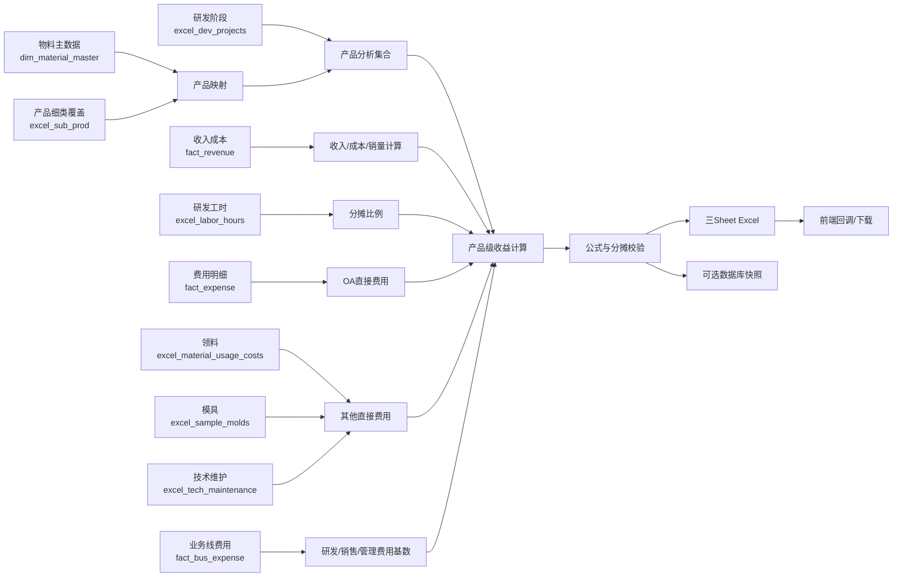

# 研发项目收益分析：计算口径与运行手册

## 1. 文档目的

本文档说明 `rd_project_profitability_flow` 的业务口径、数据来源、产品映射、逐步计算公式、Power BI 对账差异、Excel 输出和前端调用方式，供财务、研发管理、数据开发和系统维护人员后续查询。

流程解决的核心问题是：在指定期间内，每个研发产品贡献了多少收入和毛利，承担了多少直接费用及分摊费用，最终形成多少剩余收益。

流程代码入口：

- Flow：`modules/rd_project_profitability/flows/rd_project_profitability_flow.py`
- Tasks：`modules/rd_project_profitability/tasks/rd_project_profitability_tasks.py`
- 测试：`tests/test_rd_project_profitability.py`

## 2. 核心结果公式

对每个产品细类 `i`，最终计算关系为：

```text
研发相关毛利_i = 研发相关收入_i - 研发相关成本_i

费用总额_i = OA费用_i
           + 领料费用_i
           + 模具费用_i
           + 研发费用分摊_i
           + 技术维护费_i
           + 销售费用分摊_i
           + 管理费用分摊_i

剩余收益（规范口径）_i = 研发相关毛利_i - 费用总额_i

剩余收益（Power BI口径）_i = 电子支付毛利_i - 费用总额_i
```

规范口径用于回答研发项目的实际收益问题；Power BI 口径用于核对当前 Power BI 度量值 `[本期研发相关剩余收益]`。两种口径同时保留，避免技术服务收入进入展示毛利、却没有进入现有 Power BI 剩余收益时造成误解。

## 3. 整体数据流程



执行顺序为：解析期间 → 加载源数据 → 建立产品集合和映射 → 计算收入成本 → 归集直接费用 → 计算分摊基数及比例 → 计算收益 → 校验 → 生成 Excel → 可选写库 → 回调前端。

## 4. 计算期间和分析粒度

### 4.1 期间

所有源表均按闭区间计算：

```text
start_date <= 数据日期 <= end_date
```

默认期间为最近已结束月份的年初至月末。例如运行日为 `2026-07-28`，默认期间为 `2026-01-01` 至 `2026-06-30`。

正式调用建议前端始终显式传入 `start_date` 和 `end_date`，不要依赖运行日期推断高影响财务期间。

### 4.2 粒度

结果粒度为：

```text
一个计算期间 + 一个产品细类
```

如果源数据无法关联至当期研发产品集合，则汇总到显式的 `未映射产品` 行，不再使用难以识别的 Power BI 空白行。

## 5. 数据来源清单

| 数据表 | 日期字段 | 主要使用字段 | 用途 |
|---|---|---|---|
| `excel_dev_projects` | `date` | `product_sub_category`, `proj_status` | 确定当期研发产品集合和项目阶段 |
| `dim_material_master` | 无 | `encoding`, `name`, `material_group`, `material_major_category` | 将收入表物料编码映射到产品细类 |
| `excel_sub_prod` | 无 | `encoding`, `product_sub_category` | 覆盖物料名称自动推导的产品细类 |
| `fact_revenue` | `acct_period` | `mat_code`, `inc_major_cat`, `sales_qty`, 收入和成本字段, `unique_lvl` | 计算销量、收入、成本和毛利 |
| `dim_org_struc` | 无 | `unique_lvl`, `prim_org`, `sec_org`, `map_rel`, `prim_org_map` | 组织过滤和技术服务业务判断 |
| `fact_expense` | `acct_period` | `product_sub_category`, `exp_amt`, `exp_nature`, `summary` | 计算研发相关 OA 费用 |
| `excel_labor_hours` | `date` | `product_sub_category`, `hours_worked` | 计算研发工时占比 |
| `excel_material_usage_costs` | `date` | `product_sub_category`, `accounted_amount` | 计算领料费用 |
| `excel_sample_molds` | `bus_date` | `product_sub_category`, `amt_tax_exc_loc` | 计算打样模具费用 |
| `excel_tech_maintenance` | `date` | `product_sub_category`, `amt` | 计算技术维护费 |
| `fact_bus_expense` | `acct_period` | `prim_subj`, `bus_line`, `exp_amt`, `unique_lvl` | 取得研发、销售、管理费用分摊基数 |

## 6. 产品集合和映射规则

产品映射决定收入、成本和费用最终落到哪个研发项目，是整个计算最重要的前置步骤。

### 6.1 研发产品集合

当期研发产品集合来自：

```sql
excel_dev_projects.product_sub_category
```

在比较产品名称时执行以下规范化：

1. 去除首尾空格。
2. 将连续空白字符统一处理。
3. 按大小写不敏感方式匹配。
4. 同一产品存在多个书写变体时合并为一行。

例如 `N6 Pro`、`N6 Pro ` 和仅大小写不同的值会视为同一产品。2026年1—6月 PostgreSQL 中有 177 个原始产品字符串，规范化后与 Power BI 一致，为 175 个产品。

### 6.2 项目阶段

项目阶段来自 `excel_dev_projects.proj_status`：

- 一个产品在期间内只有一个唯一状态：输出该状态。
- 同一产品存在多个不同状态：输出空值，提示阶段口径不唯一。
- 状态本身为空：输出空值。

这对应 Power BI 中 `HASONEVALUE + MAX` 的行为。

### 6.3 物料编码到产品细类

收入成本表只有物料编码，因此先根据物料主数据建立映射：

1. 排除物料分组 `中正成品`、`研发手装样机成品`。
2. 只保留有效物料大类为 `产成品` 或 `服务` 的记录。
3. 从物料名称第一个 `-` 之前的文本推导产品细类，并移除中文字符。
4. `技术服务费` 特殊映射为 `技术服务`。
5. 如果 `excel_sub_prod` 对同一物料编码配置了产品细类，覆盖自动推导结果。

同一物料编码如果配置到多个不同产品细类，流程会中止并提示映射冲突，不会任意选择。

### 6.4 未映射产品

以下数据进入 `未映射产品`：

- 收入成本表的物料编码无法映射至产品主数据。
- 产品主数据能得到产品细类，但该产品不在当期研发产品集合。
- 工时、领料、模具、技术维护等直接表中的产品不在当期研发产品集合。
- OA 产品存在于产品主数据，但不在当期研发产品集合。

OA 费用还有另一种情况：费用产品细类根本不存在于 Power BI 产品主数据。这类金额不进入项目明细，而是单独记录为 `产品主数据未承接OA费用`，用于推动主数据整改。

## 7. 收入、成本、销量和毛利

以下公式中的 `i` 表示产品细类。

### 7.1 电子支付基础口径

电子支付收入和成本既用于现有 Power BI 毛利率、剩余收益，也用于计算收入占比和成本占比：

```text
电子支付收入_i = SUM(fact_revenue.amt_tax_exc_loc)
                 条件：inc_major_cat = "电子支付"

电子支付成本_i = SUM(cost_amt + freight_cost + soft_cost + tariff_cost)
                 条件：inc_major_cat = "电子支付"

电子支付毛利_i = 电子支付收入_i - 电子支付成本_i

毛利率（Power BI口径）_i = 电子支付毛利_i / 电子支付收入_i
```

分母为零时，流程输出 0，而不是产生除零错误。

### 7.2 研发相关收入

```text
研发相关收入_i
  = 电子支付收入_i
  + 技术服务收入_i

电子支付收入纳入条件：
  inc_major_cat = "电子支付"
  且二级组织 = "国际业务中心"

技术服务收入纳入条件：
  inc_major_cat = "技术服务"
  且二级组织 = "国际业务中心"
```

### 7.3 研发相关成本

```text
研发相关成本_i
  = 电子支付成本_i
  + 技术服务成本_i

技术服务成本纳入条件：
  inc_major_cat = "技术服务"
  且一级组织名称包含“渠道”
```

研发相关收入和研发相关成本使用不同组织判断。收入的两个类别都只保留国际业务中心；成本仍按电子支付成本加渠道组织的技术服务成本计算。

### 7.4 研发相关毛利

```text
研发相关毛利_i = 研发相关收入_i - 研发相关成本_i

研发相关毛利率（规范口径）_i
  = 研发相关毛利_i / 研发相关收入_i
```

### 7.5 销量

```text
本期销量_i = SUM(sales_qty)
```

销量只统计电子支付收入行，且对应记录的 `amt_tax_exc_loc` 必须非零。这是因为 Power BI 在将收入成本表逆透视后会过滤金额为零的行；如果直接对原始收入表无条件汇总销量，会比 Power BI 多统计零收入记录。

### 7.6 组织公共过滤

收入成本数据排除：

```text
dim_org_struc.prim_org_map = "无归属"
```

无法关联组织维度的记录按 Power BI “不等于无归属”的行为保留。

## 8. 直接费用

### 8.1 OA费用

OA费用来自 `fact_expense.exp_amt`，同时满足：

```text
组织映射关系 map_rel ∈ {技术中心, 产品中心}
一级组织映射 prim_org_map = 支付硬件事业群
费用性质 exp_nature = 变动费用
摘要不包含“研发费用”
摘要不包含“其他出库”
摘要不包含“其他入库”
```

通过产品主数据承接后，按产品直接归集：

```text
OA费用_i = SUM(符合条件且可被产品主数据承接的 exp_amt)
```

无法被产品主数据承接的金额不静默丢弃，会进入校验指标 `excluded_oa_amount`。

### 8.2 领料费用

```text
领料费用_i = SUM(excel_material_usage_costs.accounted_amount)
```

### 8.3 模具费用

```text
模具费用_i = SUM(excel_sample_molds.amt_tax_exc_loc)
```

### 8.4 技术维护费

```text
技术维护费_i = SUM(excel_tech_maintenance.amt)
```

领料、模具和技术维护费均按源表产品细类直接归集，未匹配当期研发产品的金额进入 `未映射产品`。

## 9. 费用基数

研发费用、销售费用和管理费用基数来自 `fact_bus_expense.exp_amt`，公共条件为：

```text
业务线 ∈ {国际业务, 国内硬件, 美国业务}
一级组织映射 != "无归属"
```

三个基数分别为：

```text
研发费用基数 = SUM(exp_amt)，一级科目 = 研发费用
销售费用基数 = SUM(exp_amt)，一级科目 = 销售费用
管理费用基数 = SUM(exp_amt)，一级科目 = 管理费用
```

费用基数在 Excel 每一产品行重复展示，是为了方便核对分摊池；它们不是每个产品各自拥有的费用。

## 10. 分摊比例和分摊费用

### 10.1 工时占比

```text
研发工时_i = SUM(excel_labor_hours.hours_worked)

工时占比_i = 研发工时_i / SUM(所有产品研发工时)
```

分母包含 `未映射产品` 的研发工时，以复现 Power BI 空白成员参与分摊的行为。

### 10.2 收入占比

```text
收入占比_i = 电子支付收入_i / SUM(所有产品电子支付收入)
```

收入占比不使用“研发相关收入”，而是使用电子支付收入。这是当前 Power BI 页面筛选上下文决定的结果。

### 10.3 成本占比

```text
成本占比_i = 电子支付成本_i / SUM(所有产品电子支付成本)
```

成本占比同样不使用“研发相关成本”。

### 10.4 研发费用分摊

先计算可分摊研发费用池：

```text
研发费用可分摊池
  = 研发费用基数
  - 领料费用合计
  - 模具费用合计
  - Power BI选中产品OA费用合计
```

再按工时占比分摊：

```text
研发费用分摊_i = 研发费用可分摊池 × 工时占比_i
```

这里保留了 Power BI 的特殊总计行为：领料和模具合计包含 `未映射产品`，OA 扣减合计不包含 `未映射产品`。因此 Power BI 明细合计和总计会出现差异，详见第13节。

### 10.5 销售费用分摊

```text
销售费用可分摊池
  = 销售费用基数 - 技术维护费合计

销售费用分摊_i
  = 销售费用可分摊池 × 收入占比_i
```

技术维护费合计包含 `未映射产品`。

### 10.6 管理费用分摊

```text
管理费用分摊_i = 管理费用基数 × 成本占比_i
```

### 10.7 零分母处理

当工时、电子支付收入或电子支付成本合计为零时，对应占比和分摊金额输出 0。流程不会自动改用其他分摊因子，也不会把费用平均分配。

## 11. 费用总额和收益

### 11.1 七类费用

```text
费用总额_i
  = OA费用_i
  + 领料费用_i
  + 模具费用_i
  + 研发费用分摊_i
  + 技术维护费_i
  + 销售费用分摊_i
  + 管理费用分摊_i
```

### 11.2 规范口径

```text
剩余收益（规范口径）_i
  = 研发相关毛利_i - 费用总额_i
```

这是流程建议作为业务分析主指标的口径，因为分子和最终收益均包含符合规则的技术服务业务。

### 11.3 Power BI兼容口径

```text
剩余收益（Power BI口径）_i
  = 电子支付毛利_i - 费用总额_i
```

此列用于与当前 Power BI `[本期研发相关剩余收益]` 对账。

### 11.4 两种口径差额

```text
口径差额_i
  = 剩余收益（规范口径）_i
  - 剩余收益（Power BI口径）_i
```

差额等于“国际业务中心的研发相关毛利”与“全部电子支付毛利”之间的差异，可能为正，也可能为负。

## 12. 流程执行步骤

Flow 实际按以下顺序执行：

1. 解析并校验 `start_date`、`end_date`。
2. 发送 `started` 回调（可关闭）。
3. 按期间读取10组源数据。
4. 规范化研发产品集合和项目阶段。
5. 建立物料编码到产品细类的映射。
6. 将各源数据归集到产品或 `未映射产品`。
7. 计算电子支付收入成本、研发相关收入成本、销量和毛利。
8. 计算四类直接费用。
9. 取得研发、销售、管理费用基数。
10. 计算工时、收入、成本占比和三类分摊费用。
11. 计算费用总额和两种剩余收益。
12. 执行公式闭合与分摊闭合校验。
13. 生成三Sheet Excel。
14. 如 `write_to_db=true`，事务替换写入期间快照。
15. 返回文件元数据并发送 `completed` 回调。
16. 任一步骤失败时发送 `failed` 回调并保留 Prefect 失败状态。

## 13. Power BI总计差异

流程逐产品复现当前 Power BI 明细，同时把 Power BI 总计上下文的非加总问题显式记录。

### 13.1 未映射产品OA差异

当前 Power BI 明细包含空白产品行的 OA 费用，但总计上下文计算研发费用池时未扣除这部分 OA：

```text
费用明细汇总 - Power BI费用总计
  = 未映射产品OA费用
```

2026年1—6月该差异为 `279,900.00` 元。

### 13.2 毛利与剩余收益口径差异

Power BI 表格展示的“毛利”使用研发相关收入和成本，但“剩余收益”使用电子支付收入和成本：

```text
规范剩余收益 - Power BI剩余收益
  = 研发相关毛利 - 电子支付毛利
```

2026年1—6月按新收入口径计算后，差异为 `-10,951,132.36` 元。负数表示国际业务中心的研发相关毛利低于全部电子支付毛利。

### 13.3 产品主数据未承接OA

有些费用符合 OA 组织、性质和摘要筛选，但其产品细类不存在于 Power BI 产品主数据。这些金额不会进入产品明细，流程单独输出：

```text
产品主数据未承接OA费用 = excluded_oa_amount
```

2026年1—6月为 `3,578,465.82` 元。该指标不等同于 `未映射产品`：

- `未映射产品`：数据可以进入 Power BI 产品关系，但无法对应当期研发项目。
- `未承接OA`：数据在产品主数据关系之前已经无法匹配，当前 Power BI 明细不会展示。

## 14. 自动校验规则

流程在生成 Excel 前执行以下校验，默认容差为 `0.01` 元：

| 校验项 | 期望结果 |
|---|---|
| 七类费用之和 | 等于每行费用总额 |
| 研发相关收入减成本 | 等于研发相关毛利 |
| 研发相关毛利减费用 | 等于规范剩余收益 |
| 电子支付毛利减费用 | 等于 Power BI 剩余收益 |
| 研发费用分摊合计 | 等于研发费用可分摊池 |
| 销售费用分摊合计 | 等于销售费用可分摊池 |
| 管理费用分摊合计 | 等于管理费用基数 |
| 工时/收入/成本占比合计 | 分母非零时等于1，分母为零时等于0 |

任一公式或分摊残差超过容差，流程直接失败，不生成“看似成功”的报表。

同时输出但不作为失败条件的观察指标包括：

- `excluded_oa_amount`：产品主数据未承接 OA。
- `unmapped_oa_amount`：未映射产品 OA。
- `power_bi_non_additive_expense_gap`：Power BI 明细合计与总计差异。
- `power_bi_grand_total_remaining_profit`：按 Power BI 总计上下文重新计算的剩余收益。

## 15. Excel输出说明

文件名格式：

```text
研发项目收益分析_<开始日期>_<结束日期>_<生成时间>.xlsx
```

### 15.1 `研发项目收益`

| Excel字段 | 含义 |
|---|---|
| 产品细类 | 规范化后的研发产品，或“未映射产品” |
| 项目所属阶段 | 当期唯一项目状态；多状态时为空 |
| 映射状态 | 已映射/未映射 |
| 本期销量(个) | 有非零电子支付收入的销售数量 |
| 本期研发相关收入 | 二级组织为国际业务中心的电子支付和技术服务收入 |
| 本期研发相关成本 | 电子支付 + 符合组织条件的技术服务成本 |
| 研发相关毛利 | 研发相关收入减研发相关成本 |
| 研发相关毛利率（规范口径） | 研发相关毛利除以研发相关收入 |
| 毛利率（Power BI口径） | 电子支付毛利除以电子支付收入 |
| 电子支付收入/成本/毛利 | 当前 Power BI 分摊和剩余收益基础口径 |
| 费用总额 | 七类费用合计 |
| 剩余收益（规范口径） | 研发相关毛利减费用 |
| 剩余收益（Power BI口径） | 电子支付毛利减费用 |
| 口径差额 | 两种剩余收益之差 |
| OA/领料/模具/技术维护费 | 产品直接归集费用 |
| 研发/销售/管理费用分摊 | 按相应占比分摊的费用 |
| 收入/工时/成本占比 | 三种分摊权重 |
| 研发/销售/管理费用基数 | 期间公共费用基数，非产品独立费用 |

### 15.2 `汇总与校验`

包含期间、生成时间、项目行数、收入、成本、毛利、费用、两种剩余收益、Power BI 总计差异和产品主数据未承接 OA。

### 15.3 `计算口径`

面向报表接收人的简版公式说明，便于 Excel 离线流转后仍能理解口径。

## 16. Flow参数

| 参数 | 默认值 | 说明 |
|---|---|---|
| `start_date` | 最近已结月所在年份1月1日 | 必须与 `end_date` 同时提供 |
| `end_date` | 最近已结月月末 | 闭区间结束日期 |
| `write_to_db` | `false` | 是否写入期间快照，生成 Excel 不依赖写库 |
| `target_table` | `fact_rd_project_profitability` | 只允许小写字母、数字和下划线 |
| `output_dir` | `RD_PROJECT_OUTPUT_DIR` 或项目默认目录 | Excel服务器绝对目录 |
| `download_base_url` | `RD_PROJECT_DOWNLOAD_BASE_URL` | 前端文件下载基础URL |
| `notify_frontend` | `true` | 是否发送 started/completed/failed 回调 |
| `callback_url` | 回调环境变量默认值 | 可由前端覆盖 |
| `tolerance` | `0.01` | 公式和分摊校验容差，单位元 |

默认行为是只读数据库、生成 Excel、发送回调，不写业务结果表。

## 17. 前端调用和返回

### 17.1 推荐交互

1. 前端通过 Prefect Deployment API 触发 `主流程-研发项目收益分析`。
2. 保存 Prefect 返回的 `flow_run_id`。
3. 页面显示“计算中”。
4. 以 webhook completed/failed 回调作为主要结果通道。
5. 回调超时或用户主动刷新时，通过 Prefect Flow Run API 查询状态。
6. completed 回调到达后，展示 `download_url` 下载按钮。

触发参数示例：

```json
{
  "name": "rd-profitability-2026-ytd",
  "parameters": {
    "start_date": "2026-01-01",
    "end_date": "2026-06-30",
    "write_to_db": false,
    "output_dir": "/mnt/reports/rd-project",
    "download_base_url": "https://finance.example.com/api/reports/rd-project",
    "notify_frontend": true,
    "callback_url": "https://finance.example.com/api/callbacks/prefect"
  }
}
```

### 17.2 成功结果

Flow 返回值是 JSON 可序列化字典，不是 DataFrame：

```json
{
  "status": "completed",
  "period_start": "2026-01-01",
  "period_end": "2026-06-30",
  "report": {
    "file_name": "研发项目收益分析_20260101_20260630_20260728123000123456.xlsx",
    "output_path": "/mnt/reports/rd-project/研发项目收益分析_....xlsx",
    "download_url": "https://finance.example.com/api/reports/rd-project/...xlsx",
    "media_type": "application/vnd.openxmlformats-officedocument.spreadsheetml.sheet",
    "size_bytes": 34833,
    "row_count": 176,
    "sheet_names": ["研发项目收益", "汇总与校验", "计算口径"]
  },
  "validation": {
    "remaining_profit_total": 140845807.39,
    "power_bi_remaining_profit_total": 136326504.14
  }
}
```

### 17.3 下载安全

前端文件服务只允许读取配置好的报表根目录，并根据 `file_name` 或内部文件标识下载。不要让客户端提交任意服务器绝对路径。

未配置 `download_base_url` 时，`download_url` 为 `null`。此时需要前端后端根据受控的 `output_path` 建立下载响应。

## 18. 可选数据库快照

当 `write_to_db=true` 时，流程写入 `fact_rd_project_profitability` 或指定目标表。

幂等规则：

1. 使用 `(period_start, period_end, product_sub_category)` 作为唯一键。
2. 对同一目标表和期间取得 PostgreSQL 事务级 advisory lock。
3. 在同一事务内删除完全相同期间的旧快照。
4. 插入本次完整结果。
5. 任一删除或插入失败时整体回滚。

数据库写入不是生成 Excel 的前提。日常前端查询建议保持 `write_to_db=false`；只有其他系统需要直接查询固定快照时再显式开启。

## 19. 2026年1—6月验证基线

自2026年7月28日起，研发相关收入改为只统计二级组织为国际业务中心的电子支付和技术服务收入。用户最初提供的 Excel 使用调整前的收入口径，因此研发相关收入、毛利和规范口径剩余收益不再与原 Excel 一致。成本、七类费用、分摊比例和原 Power BI 剩余收益兼容列未变。

| 指标 | 验证值 |
|---|---:|
| 规范化研发产品数 | 175 |
| 含未映射产品的Excel行数 | 176 |
| 国际业务中心电子支付收入 | 732,116,775.74 |
| 国际业务中心技术服务收入 | 4,519,303.25 |
| 研发相关收入 | 736,636,078.99 |
| 研发相关成本 | 481,379,712.89 |
| 研发相关毛利 | 255,256,366.10 |
| 费用明细汇总 | 129,880,994.32 |
| Power BI费用总计 | 129,601,094.32 |
| Power BI费用非加总差异 | 279,900.00 |
| 剩余收益（规范口径） | 125,375,371.78 |
| 剩余收益（Power BI明细汇总口径） | 136,326,504.14 |
| Power BI总计上下文剩余收益 | 136,606,404.14 |
| 两种收益口径差额 | -10,951,132.36 |
| 产品主数据未承接OA费用 | 3,578,465.82 |

新口径相比调整前减少研发相关收入 `15,470,435.61` 元，研发相关成本和费用不变，因此规范口径剩余收益同额减少。公式、分摊和文件生成校验均已通过。

## 20. 日常运行检查清单

运行前：

- 明确开始日期和结束日期。
- 确认收入、费用、工时、阶段和直接费用数据已更新至目标期间。
- 确认产品细类及物料映射已经维护。
- 确认前端输出目录和下载URL配置正确。
- 除非明确需要快照表，否则保持 `write_to_db=false`。

运行后：

- Flow Run 状态必须为 Completed。
- Excel必须包含3个Sheet且行数不为0。
- 三种占比合计应为1或在无数据时为0。
- 三类分摊残差应在容差内。
- 检查 `未映射产品` 金额是否异常增大。
- 检查 `产品主数据未承接OA费用` 是否需要整改。
- 检查 Power BI 非加总差异和两种剩余收益口径差额。
- 对外发送报表时说明采用哪一种剩余收益口径。

## 21. 常见问题

| 现象 | 可能原因 | 处理建议 |
|---|---|---|
| 结果只有部分产品 | `excel_dev_projects` 在目标期间缺少产品 | 补充研发阶段表或核对期间 |
| 产品进入“未映射产品” | 产品未进入阶段表、物料编码无映射或产品名称不一致 | 维护 `excel_dev_projects`、`dim_material_master` 或 `excel_sub_prod` |
| OA未承接金额较大 | 费用产品细类不存在于产品主数据 | 核对费用填报和产品主数据 |
| 研发费用分摊为0 | 目标期间研发工时合计为0 | 补充工时数据，不建议自动平均分配 |
| 销售费用分摊为0 | 电子支付收入合计为0 | 核对收入数据及收入大类 |
| 管理费用分摊为0 | 电子支付成本合计为0 | 核对成本字段及产品映射 |
| Power BI总计不等于明细合计 | OA空白成员的 `ALLSELECTED` 总计行为 | 查看“汇总与校验”中的非加总差异 |
| 毛利正常但剩余收益与预期不同 | Power BI剩余收益仅使用电子支付毛利 | 使用规范口径列并核对口径差额 |
| 回调完成但没有下载链接 | 未配置 `RD_PROJECT_DOWNLOAD_BASE_URL` | 配置下载基础URL或由后端基于受控路径提供文件 |
| Flow校验失败 | 公式或分摊未闭合，或数据结构变化 | 查看Prefect日志，不要绕过校验直接发报表 |

## 22. 口径变更管理

以下任一规则变化都属于业务口径变更，需要同步更新代码、测试和本文档：

- 研发相关收入或成本的收入大类、组织条件。
- 纳入分摊基数的业务线。
- OA费用的组织、费用性质或摘要排除条件。
- 研发、销售或管理费用的分摊因子。
- 产品映射和未映射数据处理方式。
- 规范剩余收益与 Power BI 兼容口径的主次关系。

变更后至少使用一个明确期间执行影子计算，并比较：产品行数、收入成本合计、直接费用、分摊池、占比合计、剩余收益和未映射金额。未经核对，不应直接替换对外报表口径。
